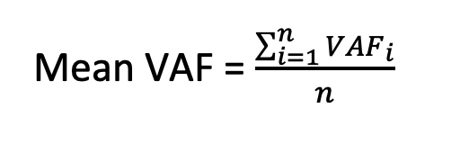
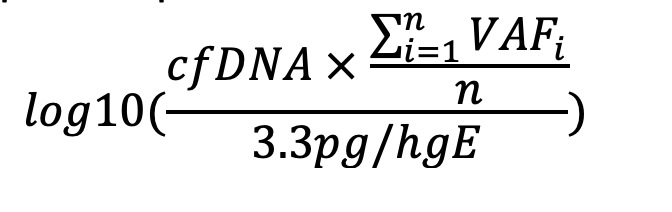

# ctDNA Quantification

Implementation of ctDNA concentration quantification in log10-transformed 
haploid genome equivalents per milliliter of plasma (log10 hGE/mL).

## Method

ctDNA concentration was measured in haploid genomic equivalents per 
milliliter of plasma (hGE/ml) assuming that one haploid genome weighs 
3.3 picograms. ctDNA concentration was calculated by multiplying the 
cell-free DNA concentration in plasma (picograms per milliliter, pg/ml) 
by the mean allele fraction of the patient specific reporter mutations 
divided by 3.3 (pg/hGE) and reported as a 10-base logarithm.

ctDNA concentration = log10( cfDNA_plasma × mean(VAF_reporters) / 3.3 pg/hGE )

- Definition of Mean VAF per sample:
   

- Updated the formula of hGE/ml per sample:
   

- n: number of reporter mutations per sample

